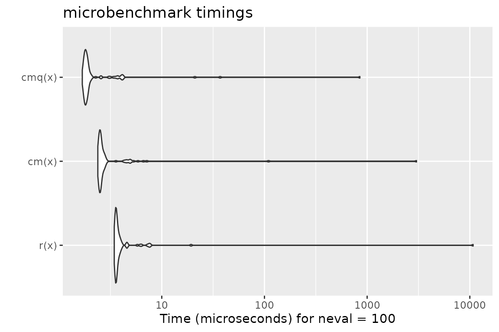
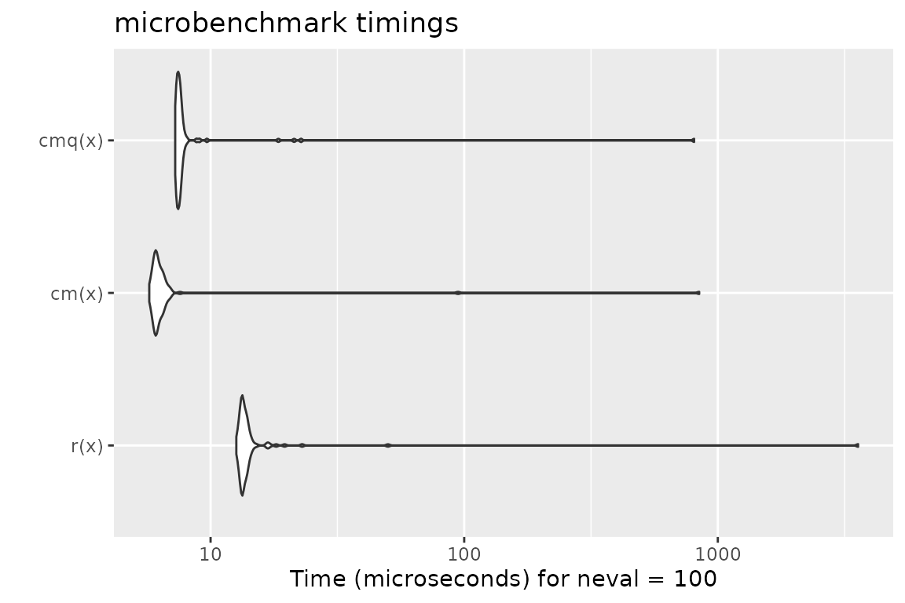
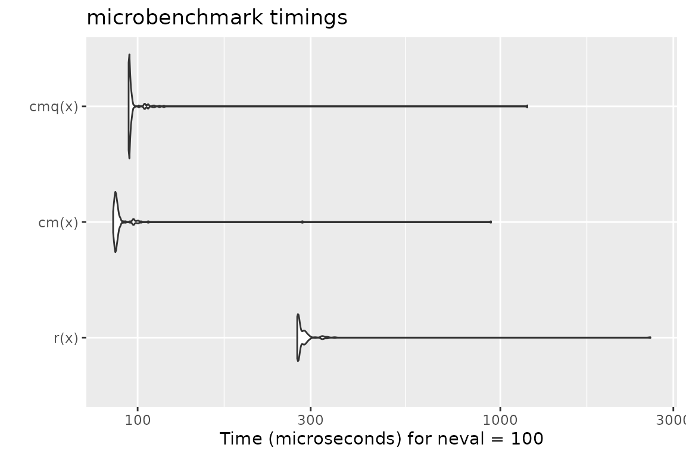
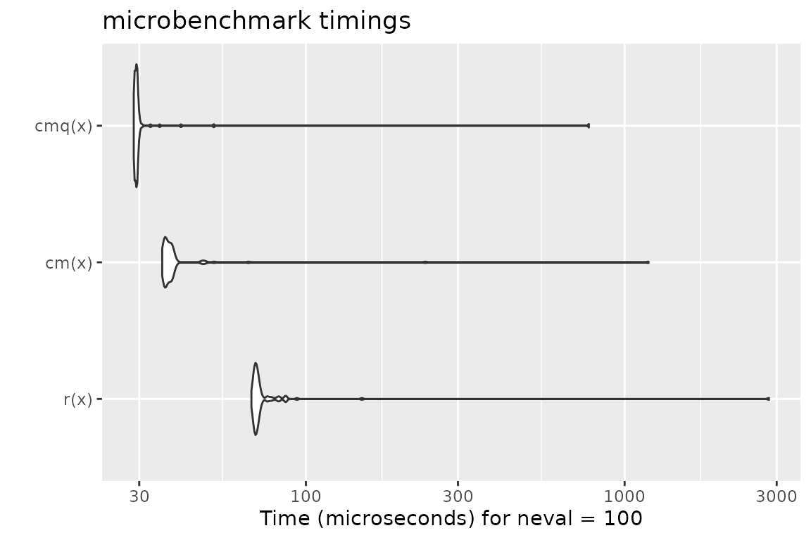
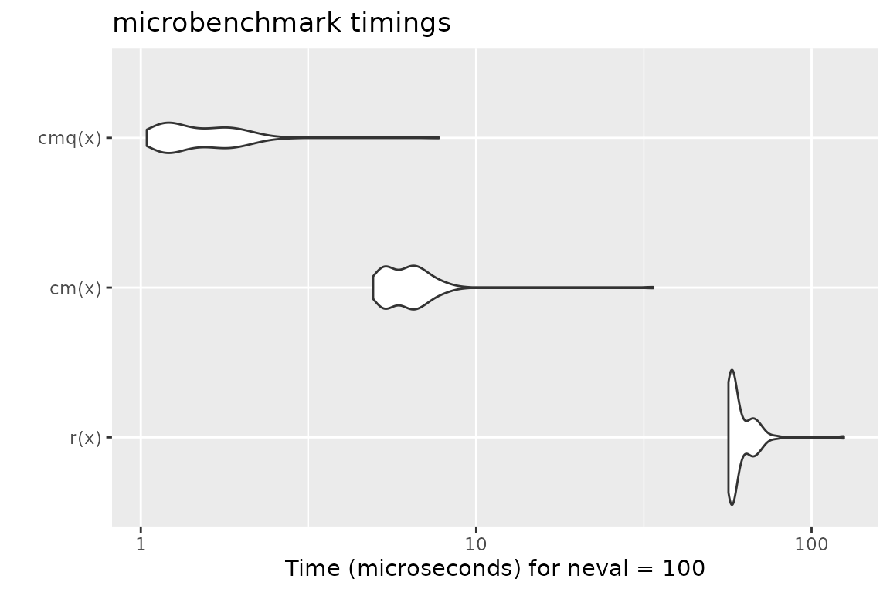
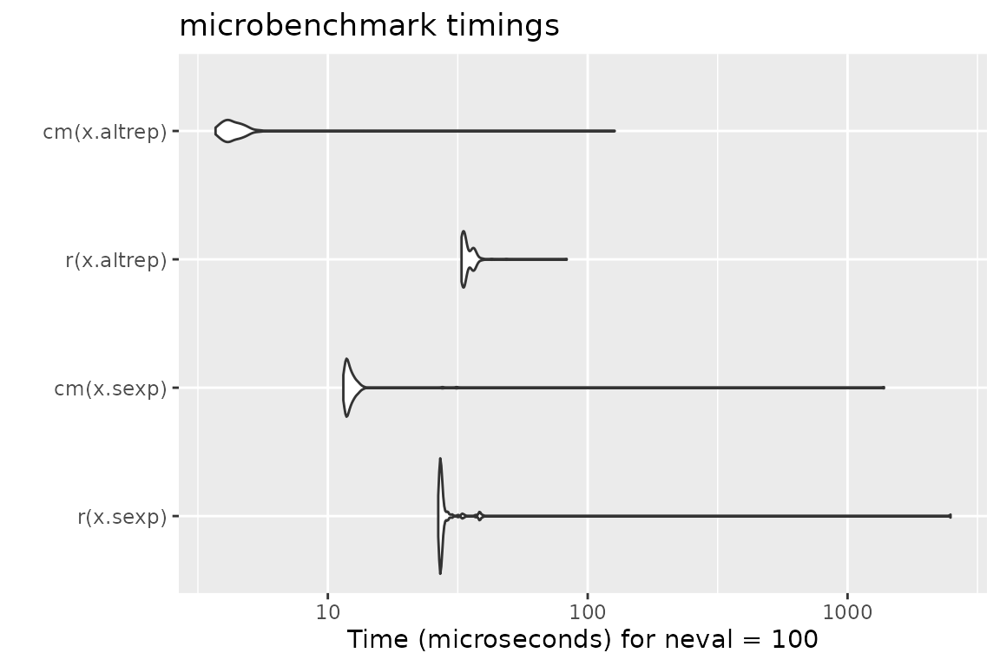

# Checkmate

Ever used an R function that produced a not-very-helpful error message,
just to discover after minutes of debugging that you simply passed a
wrong argument?

Blaming the laziness of the package author for not doing such standard
checks (in a dynamically typed language such as R) is at least partially
unfair, as R makes these types of checks cumbersome and annoying. Well,
that’s how it was in the past.

Enter checkmate.

Virtually **every standard type of user error** when passing arguments
into function can be caught with a simple, readable line which produces
an **informative error message** in case. A substantial part of the
package was written in C to **minimize any worries about execution time
overhead**.

## Intro

As a motivational example, consider you have a function to calculate the
faculty of a natural number and the user may choose between using either
the stirling approximation or R’s `factorial` function (which internally
uses the gamma function). Thus, you have two arguments, `n` and
`method`. Argument `n` must obviously be a positive natural number and
`method` must be either `"stirling"` or `"factorial"`. Here is a version
of all the hoops you need to jump through to ensure that these simple
requirements are met:

``` r
fact <- function(n, method = "stirling") {
  if (length(n) != 1)
    stop("Argument 'n' must have length 1")
  if (!is.numeric(n))
    stop("Argument 'n' must be numeric")
  if (is.na(n))
    stop("Argument 'n' may not be NA")
  if (is.double(n)) {
    if (is.nan(n))
      stop("Argument 'n' may not be NaN")
    if (is.infinite(n))
      stop("Argument 'n' must be finite")
    if (abs(n - round(n, 0)) > sqrt(.Machine$double.eps))
      stop("Argument 'n' must be an integerish value")
    n <- as.integer(n)
  }
  if (n < 0)
    stop("Argument 'n' must be >= 0")
  if (length(method) != 1)
    stop("Argument 'method' must have length 1")
  if (!is.character(method) || !method %in% c("stirling", "factorial"))
    stop("Argument 'method' must be either 'stirling' or 'factorial'")

  if (method == "factorial")
    factorial(n)
  else
    sqrt(2 * pi * n) * (n / exp(1))^n
}
```

And for comparison, here is the same function using checkmate:

``` r
fact <- function(n, method = "stirling") {
  assertCount(n)
  assertChoice(method, c("stirling", "factorial"))

  if (method == "factorial")
    factorial(n)
  else
    sqrt(2 * pi * n) * (n / exp(1))^n
}
```

## Function overview

The functions can be split into four functional groups, indicated by
their prefix.

If prefixed with `assert`, an error is thrown if the corresponding check
fails. Otherwise, the checked object is returned invisibly. There are
many different coding styles out there in the wild, but most R
programmers stick to either `camelBack` or `underscore_case`. Therefore,
`checkmate` offers all functions in both flavors: `assert_count` is just
an alias for `assertCount` but allows you to retain your favorite style.

The family of functions prefixed with `test` always return the check
result as logical value. Again, you can use `test_count` and `testCount`
interchangeably.

Functions starting with `check` return the error message as a string (or
`TRUE` otherwise) and can be used if you need more control and, e.g.,
want to grep on the returned error message.

`expect` is the last family of functions and is intended to be used with
the [testthat package](https://cran.r-project.org/package=testthat). All
performed checks are logged into the `testthat` reporter. Because
`testthat` uses the `underscore_case`, the extension functions only come
in the underscore style.

All functions are categorized into objects to check on the [package help
page](https://mllg.github.io/checkmate/reference/checkmate-package).

## In case you miss flexibility

You can use [assert](https://mllg.github.io/checkmate/reference/assert)
to perform multiple checks at once and throw an assertion if all checks
fail.

Here is an example where we check that x is either of class `foo` or
class `bar`:

``` r
f <- function(x) {
  assert(
    checkClass(x, "foo"),
    checkClass(x, "bar")
  )
}
```

Note that `assert(, combine = "or")` and `assert(, combine = "and")`
allow to control the logical combination of the specified checks, and
that the former is the default.

## Argument Checks for the Lazy

The following functions allow a special syntax to define argument checks
using a special format specification. E.g., `qassert(x, "I+")` asserts
that `x` is an integer vector with at least one element and no missing
values. This very simple domain specific language covers a large variety
of frequent argument checks with only a few keystrokes. You choose what
you like best.

- [qassert](https://mllg.github.io/checkmate/reference/qassert)
- [qassertr](https://mllg.github.io/checkmate/reference/qassertr)

## checkmate as testthat extension

To extend [testthat](https://cran.r-project.org/package=testthat), you
need to IMPORT, DEPEND or SUGGEST on the `checkmate` package. Here is a
minimal example:

``` r
# file: tests/test-all.R
library(testthat)
library(checkmate) # for testthat extensions
test_check("mypkg")
```

Now you are all set and can use more than 30 new expectations in your
tests.

``` r
test_that("checkmate is a sweet extension for testthat", {
  x = runif(100)
  expect_numeric(x, len = 100, any.missing = FALSE, lower = 0, upper = 1)
  # or, equivalent, using the lazy style:
  qexpect(x, "N100[0,1]")
})
```

## Speed considerations

In comparison with tediously writing the checks yourself in R (c.f.
factorial example at the beginning of the vignette), R is sometimes a
tad faster while performing checks on scalars. This seems odd at first,
because checkmate is mostly written in C and should be comparably fast.
Yet many of the functions in the `base` package are not regular
functions, but primitives. While primitives jump directly into the C
code, checkmate has to use the considerably slower `.Call` interface. As
a result, it is possible to write (very simple) checks using only the
base functions which, under some circumstances, slightly outperform
checkmate. However, if you go one step further and wrap the custom check
into a function to convenient re-use it, the performance gain is often
lost (see benchmark 1).

For larger objects the tide has turned because checkmate avoids many
unnecessary intermediate variables. Also note that the quick/lazy
implementation in `qassert`/`qtest`/`qexpect` is often a tad faster
because only two arguments have to be evaluated (the object and the
rule) to determine the set of checks to perform.

Below you find some (probably unrepresentative) benchmark. But also note
that this one here has been executed from inside `knitr` which is often
the cause for outliers in the measured execution time. Better run the
benchmark yourself to get unbiased results.

### Benchmark 1: Assert that `x` is a flag

``` r
library(checkmate)
library(ggplot2)
library(microbenchmark)

x = TRUE
r = function(x, na.ok = FALSE) { stopifnot(is.logical(x), length(x) == 1, na.ok || !is.na(x)) }
cm = function(x) assertFlag(x)
cmq = function(x) qassert(x, "B1")
mb = microbenchmark(r(x), cm(x), cmq(x))
print(mb)
```

    ## Unit: microseconds
    ##    expr   min     lq      mean median     uq       max neval
    ##    r(x) 3.447 3.5515 111.69752 3.6170 3.8120 10766.597   100
    ##   cm(x) 2.384 2.4750  34.15025 2.5350 2.7050  3025.235   100
    ##  cmq(x) 1.683 1.7830  11.08347 1.8435 1.9335   849.735   100

``` r
autoplot(mb)
```

    ## Warning: `aes_string()` was deprecated in ggplot2 3.0.0.
    ## ℹ Please use tidy evaluation idioms with `aes()`.
    ## ℹ See also `vignette("ggplot2-in-packages")` for more information.
    ## ℹ The deprecated feature was likely used in the microbenchmark package.
    ##   Please report the issue at
    ##   <https://github.com/joshuaulrich/microbenchmark/issues/>.
    ## This warning is displayed once per session.
    ## Call `lifecycle::last_lifecycle_warnings()` to see where this warning was
    ## generated.



### Benchmark 2: Assert that `x` is a numeric of length 1000 with no missing nor NaN values

``` r
x = runif(1000)
r = function(x) stopifnot(is.numeric(x), length(x) == 1000, all(!is.na(x) & x >= 0 & x <= 1))
cm = function(x) assertNumeric(x, len = 1000, any.missing = FALSE, lower = 0, upper = 1)
cmq = function(x) qassert(x, "N1000[0,1]")
mb = microbenchmark(r(x), cm(x), cmq(x))
print(mb)
```

    ## Unit: microseconds
    ##    expr    min      lq     mean median      uq      max neval
    ##    r(x) 12.634 13.2450 49.77531 13.430 13.9665 3572.755   100
    ##   cm(x)  5.731  6.0220 15.49536  6.161  6.4425  844.486   100
    ##  cmq(x)  7.253  7.3685 15.94545  7.514  7.6545  806.284   100

``` r
autoplot(mb)
```



### Benchmark 3: Assert that `x` is a character vector with no missing values nor empty strings

``` r
x = sample(letters, 10000, replace = TRUE)
r = function(x) stopifnot(is.character(x), !any(is.na(x)), all(nchar(x) > 0))
cm = function(x) assertCharacter(x, any.missing = FALSE, min.chars = 1)
cmq = function(x) qassert(x, "S+[1,]")
mb = microbenchmark(r(x), cm(x), cmq(x))
print(mb)
```

    ## Unit: microseconds
    ##    expr     min      lq      mean   median      uq      max neval
    ##    r(x) 275.444 276.611 307.65483 277.6025 287.822 2593.799   100
    ##   cm(x)  85.600  86.657  99.13041  87.1680  88.330  942.709   100
    ##  cmq(x)  94.436  94.627 107.54991  94.9720  95.984 1187.275   100

``` r
autoplot(mb)
```



### Benchmark 4: Test that `x` is a data frame with no missing values

``` r
N = 10000
x = data.frame(a = runif(N), b = sample(letters[1:5], N, replace = TRUE), c = sample(c(FALSE, TRUE), N, replace = TRUE))
r = function(x) is.data.frame(x) && !any(sapply(x, function(x) any(is.na(x))))
cm = function(x) testDataFrame(x, any.missing = FALSE)
cmq = function(x) qtest(x, "D")
mb = microbenchmark(r(x), cm(x), cmq(x))
print(mb)
```

    ## Unit: microseconds
    ##    expr    min     lq      mean  median      uq      max neval
    ##    r(x) 67.466 69.079 100.11295 70.1460 71.5190 2836.963   100
    ##   cm(x) 35.416 36.123  51.32082 36.9335 37.9910 1188.868   100
    ##  cmq(x) 28.833 29.064  37.20493 29.3900 29.5955  772.171   100

``` r
autoplot(mb)
```



``` r
# checkmate tries to stop as early as possible
x$a[1] = NA
mb = microbenchmark(r(x), cm(x), cmq(x))
print(mb)
```

    ## Unit: microseconds
    ##    expr    min      lq     mean  median     uq     max neval
    ##    r(x) 56.525 57.5325 61.56836 58.3985 65.377 124.803   100
    ##   cm(x)  4.929  5.4150  6.50415  6.2770  6.838  33.733   100
    ##  cmq(x)  1.042  1.1920  1.56775  1.3930  1.799   7.745   100

``` r
autoplot(mb)
```



### Benchmark 5: Assert that `x` is an increasing sequence of integers with no missing values

``` r
N = 10000
x.altrep = seq_len(N) # this is an ALTREP in R version >= 3.5.0
x.sexp = c(x.altrep)  # this is a regular SEXP OTOH
r = function(x) stopifnot(is.integer(x), !any(is.na(x)), !is.unsorted(x))
cm = function(x) assertInteger(x, any.missing = FALSE, sorted = TRUE)
mb = microbenchmark(r(x.sexp), cm(x.sexp), r(x.altrep), cm(x.altrep))
print(mb)
```

    ## Unit: microseconds
    ##          expr    min      lq     mean  median      uq      max neval
    ##     r(x.sexp) 26.599 27.0255 52.87679 27.2660 27.7215 2491.068   100
    ##    cm(x.sexp) 11.472 11.7620 26.16934 12.0180 12.4885 1380.976   100
    ##   r(x.altrep) 32.701 33.1270 34.99485 33.5375 36.1325   83.025   100
    ##  cm(x.altrep)  3.697  4.0320  5.64143  4.2480  4.5940  127.037   100

``` r
autoplot(mb)
```



## Extending checkmate

To extend checkmate a custom `check*` function has to be written. For
example, to check for a square matrix one can re-use parts of checkmate
and extend the check with additional functionality:

``` r
checkSquareMatrix = function(x, mode = NULL) {
  # check functions must return TRUE on success
  # and a custom error message otherwise
  res = checkMatrix(x, mode = mode)
  if (!isTRUE(res))
    return(res)
  if (nrow(x) != ncol(x))
    return("Must be square")
  return(TRUE)
}

# a quick test:
X = matrix(1:9, nrow = 3)
checkSquareMatrix(X)
```

    ## [1] TRUE

``` r
checkSquareMatrix(X, mode = "character")
```

    ## [1] "Must store characters"

``` r
checkSquareMatrix(X[1:2, ])
```

    ## [1] "Must be square"

The respective counterparts to the `check`-function can be created using
the constructors
[makeAssertionFunction](https://mllg.github.io/checkmate/reference/makeAssertion),
[makeTestFunction](https://mllg.github.io/checkmate/reference/makeTest)
and
[makeExpectationFunction](https://mllg.github.io/checkmate/reference/makeExpectation):

``` r
# For assertions:
assert_square_matrix = assertSquareMatrix = makeAssertionFunction(checkSquareMatrix)
print(assertSquareMatrix)
```

    ## function (x, mode = NULL, .var.name = checkmate::vname(x), add = NULL) 
    ## {
    ##     if (missing(x)) 
    ##         stop(sprintf("argument \"%s\" is missing, with no default", 
    ##             .var.name))
    ##     res = checkSquareMatrix(x, mode)
    ##     checkmate::makeAssertion(x, res, .var.name, add)
    ## }

``` r
# For tests:
test_square_matrix = testSquareMatrix = makeTestFunction(checkSquareMatrix)
print(testSquareMatrix)
```

    ## function (x, mode = NULL) 
    ## {
    ##     isTRUE(checkSquareMatrix(x, mode))
    ## }

``` r
# For expectations:
expect_square_matrix = makeExpectationFunction(checkSquareMatrix)
print(expect_square_matrix)
```

    ## function (x, mode = NULL, info = NULL, label = vname(x)) 
    ## {
    ##     if (missing(x)) 
    ##         stop(sprintf("Argument '%s' is missing", label))
    ##     res = checkSquareMatrix(x, mode)
    ##     makeExpectation(x, res, info, label)
    ## }

Note that all the additional arguments `.var.name`, `add`, `info` and
`label` are automatically joined with the function arguments of your
custom check function. Also note that if you define these functions
inside an R package, the constructors are called at build-time (thus,
there is no negative impact on the runtime).

## Calling checkmate from C/C++

The package registers two functions which can be used in other packages’
C/C++ code for argument checks.

``` r
SEXP qassert(SEXP x, const char *rule, const char *name);
Rboolean qtest(SEXP x, const char *rule);
```

These are the counterparts to
[qassert](https://mllg.github.io/checkmate/reference/qassert) and
[qtest](https://mllg.github.io/checkmate/reference/qassert). Due to
their simplistic interface, they perfectly suit the requirements of most
type checks in C/C++.

For detailed background information on the register mechanism, see the
[Exporting C Code](https://r-pkgs.org/src.html#c-export) section in
Hadley’s Book “R Packages” or
[WRE](https://cran.r-project.org/doc/manuals/r-release/R-exts.html#Registering-native-routines).
Here is a step-by-step guide to get you started:

1.  Add `checkmate` to your “Imports” and “LinkingTo” sections in your
    DESCRIPTION file.
2.  Create a stub C source file `"checkmate_stub.c"`, see below.
3.  Include the provided header file `<checkmate.h>` in each compilation
    unit where you want to use checkmate.

File contents for (2):

``` r
#include <checkmate.h>
#include <checkmate_stub.c>
```

## Session Info

For the sake of completeness, here the
[`sessionInfo()`](https://rdrr.io/r/utils/sessionInfo.html) for the
benchmark (but remember the note before on `knitr` possibly biasing the
results).

``` r
sessionInfo()
```

    ## R version 4.5.2 (2025-10-31)
    ## Platform: x86_64-pc-linux-gnu
    ## Running under: Ubuntu 24.04.3 LTS
    ## 
    ## Matrix products: default
    ## BLAS:   /usr/lib/x86_64-linux-gnu/openblas-pthread/libblas.so.3 
    ## LAPACK: /usr/lib/x86_64-linux-gnu/openblas-pthread/libopenblasp-r0.3.26.so;  LAPACK version 3.12.0
    ## 
    ## locale:
    ##  [1] LC_CTYPE=C.UTF-8       LC_NUMERIC=C           LC_TIME=C.UTF-8       
    ##  [4] LC_COLLATE=C.UTF-8     LC_MONETARY=C.UTF-8    LC_MESSAGES=C.UTF-8   
    ##  [7] LC_PAPER=C.UTF-8       LC_NAME=C              LC_ADDRESS=C          
    ## [10] LC_TELEPHONE=C         LC_MEASUREMENT=C.UTF-8 LC_IDENTIFICATION=C   
    ## 
    ## time zone: UTC
    ## tzcode source: system (glibc)
    ## 
    ## attached base packages:
    ## [1] stats     graphics  grDevices utils     datasets  methods   base     
    ## 
    ## other attached packages:
    ## [1] microbenchmark_1.5.0 ggplot2_4.0.2        checkmate_2.3.4     
    ## 
    ## loaded via a namespace (and not attached):
    ##  [1] vctrs_0.7.1        cli_3.6.5          knitr_1.51         rlang_1.1.7       
    ##  [5] xfun_0.56          otel_0.2.0         S7_0.2.1           textshaping_1.0.4 
    ##  [9] jsonlite_2.0.0     glue_1.8.0         backports_1.5.0    htmltools_0.5.9   
    ## [13] ragg_1.5.0         sass_0.4.10        scales_1.4.0       rmarkdown_2.30    
    ## [17] grid_4.5.2         evaluate_1.0.5     jquerylib_0.1.4    fastmap_1.2.0     
    ## [21] yaml_2.3.12        lifecycle_1.0.5    compiler_4.5.2     RColorBrewer_1.1-3
    ## [25] fs_1.6.6           htmlwidgets_1.6.4  farver_2.1.2       systemfonts_1.3.1 
    ## [29] digest_0.6.39      R6_2.6.1           pillar_1.11.1      bslib_0.10.0      
    ## [33] withr_3.0.2        gtable_0.3.6       tools_4.5.2        pkgdown_2.2.0     
    ## [37] cachem_1.1.0       desc_1.4.3
